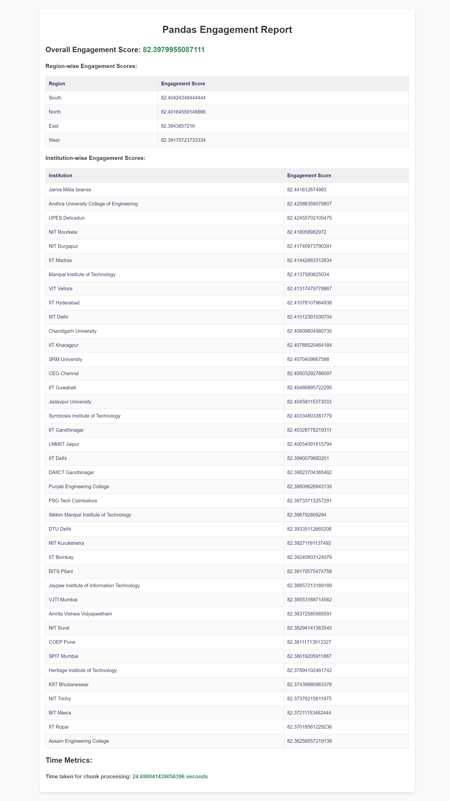

# Comparison of Pandas and FireDucks API for Engagement Score Calculation

## Overview
This project compares the time taken by the `pandas` and `FireDucks` APIs for processing large datasets and calculating engagement scores. The system is designed to process CSV data and compute engagement scores for a classroom monitoring system. The workflow uses two different libraries, `pandas` and `FireDucks`, for handling the data processing, with the goal of evaluating their performance.

## Steps to Set Up and Run the Application

### 1. Generate CSV Data

Before running the application, you need to generate the sample CSV dataset, which contains engagement data for classrooms. To generate the data:

- Open a terminal in your Linux environment.
- Navigate to the directory where the project is located.
- Run the following command to generate the CSV data:

    ```bash
    python3 generator.py
    ```

This will generate a CSV file with 50 lakh (5 million) rows of data by default. The CSV file will be used for processing in the next steps.

### 2. Running the Application

Once the CSV file is generated, you can run the application to compare the performance of the `pandas` and `FireDucks` APIs in processing the data.

- In the terminal, make sure you're in the project directory.
- Run the Flask application using the following command:

    ```bash
    python3 app.py
    ```

This will start the web application and the backend will begin processing the generated CSV data using both the `pandas` and `FireDucks` APIs.

### 3. User Interface

After the application is up and running, you can open your web browser and navigate to `http://127.0.0.1:5000`. The interface will provide the following functionalities:

- **Fireducks Report**: For processing the dataset using `FireDucks`.
- **Pandas Report**: For processing the dataset using `Pandas`.

Each action will take some time to process, depending on the size of the dataset.

### 4. Time Considerations

Please note that:

- Each button in the application might take between **3 to 5 minutes** to run, depending on the size of the generated CSV file.
- The default CSV file generates **50 lakh (5 million)** rows of data.
- The processing time for each session may vary based on the size and complexity of the data.

### 5. Results

The application will provide a detailed report and comparison metrics, such as:

- **Region Scores**
- **Institution Scores**
- **Overall Engagement Score**
- **Time taken for processing chunks using FireDucks**
- **Time taken for processing chunks using pandas**

You can compare the results of each run and analyze the performance differences between the two libraries.

#### Example Screenshots

- **Pandas Report Example**:

    

- **FireDucks Report Example**:

    

These screenshots show the engagement score reports generated by `pandas` and `FireDucks` after processing the dataset. The reports include region scores, institution scores, and overall engagement metrics.

## Conclusion

This project provides an in-depth comparison between the `pandas` and `FireDucks` libraries, focusing on their performance in processing large datasets for calculating engagement scores. By following the above steps, you can generate the required data, run the application, and compare the results.

## Warning

- **Processing time may vary**: Depending on the size of the CSV file and the resources of your machine, the application may take between 3 to 5 minutes for each action.
- **Default dataset size**: By default, the dataset contains 50 lakh (5 million) rows of data, which can impact the performance.
- **Linux environment**: The instructions provided are specifically for a Linux-based environment. If you're running this on a different operating system, some modifications may be necessary.
